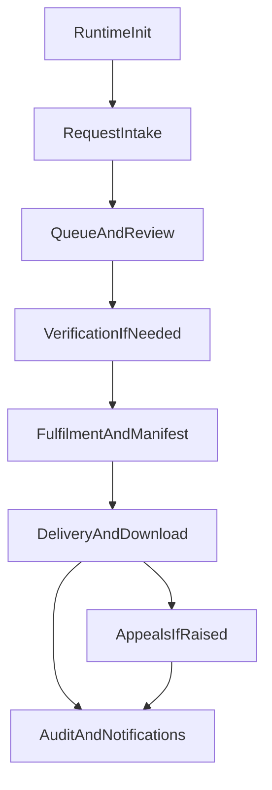

This guide connects the DSAR lifecycle into one operator-facing and
subject-facing workflow.

## Lifecycle Overview

## 1. Initialize and Intake

- `POST /init` bootstraps runtime initialization when your deployment expects an
  explicit init step.
- `POST /requests` records a request from an intake payload.
- `POST /requests/capture` captures the request and immediately returns due-date
  context in the lifecycle response.

See [Init API](./api/init.md) and [Core Request API](./api/requests.md).

## 2. Review, Explain, and Enrich

Operators typically use these endpoints while triaging the request:

- `GET /requests`
- `GET /requests/:id`
- `GET /requests/:id/timeline`
- `GET /requests/:id/clock/explain`
- `PUT /requests/:id/requestor`
- `POST /requests/:id/clarifications/request`
- `POST /requests/:id/clarifications/receive`
- `POST /requests/:id/extensions`
- `POST /requests/:id/refusals`
- `POST /requests/:id/acknowledgements`
- `POST /requests/:id/closures`

See [Core Request API](./api/requests.md).

## 3. Verify Identity or Authority

If policy or risk requires stronger proof:

- `POST /requests/:id/authority/submit`
- `POST /requests/:id/authority/approve`
- `POST /requests/:id/authority/reject`
- `POST /requests/:id/verification/request`
- `POST /requests/:id/verification/evidence`
- `POST /requests/:id/verification/evidence/upload`
- `POST /requests/:id/verification/approve`
- `POST /requests/:id/verification/reject`
- `GET /requests/:id/verification-case`

See [Verification API](./api/verification.md).

## 4. Assemble the Fulfilment Package

Once the request is moving toward completion:

- `GET /requests/:id/manifest`
- `POST /requests/:id/manifest/validate`
- `POST /requests/:id/manifest/artifact/upload`
- `GET /requests/:id/manifest/artifact/download`
- `PUT /requests/:id/manifest/artifact/:artifactId/replace`
- `POST /requests/:id/fulfilment`
- `POST /requests/:id/fulfilment/callback`

See [Manifest API](./api/manifest.md) and [Delivery API](./api/delivery.md).

## 5. Deliver and Track Access

DSAR supports prepared delivery plus token-gated access:

- `POST /requests/:id/delivery/prepare`
- `POST /requests/:id/delivery/address/verify`
- `POST /requests/:id/delivery/step-up/challenge`
- `POST /requests/:id/delivery/step-up/complete`
- `GET /requests/:id/artifacts/:artifactId/download`
- `GET /requests/:id/delivery/logs`

See [Delivery API](./api/delivery.md).

## 6. Appeal, Audit, and Notifications

After delivery, the request may still branch into follow-up workflows:

- `POST /requests/:id/appeals`
- `GET /requests/:id/appeals`
- `POST /requests/:id/appeals/:appealId/decide`
- `GET /requests/:id/audit/export`
- `POST /requests/:id/audit/verify`
- `GET /requests/:id/notifications`
- `POST /requests/:id/notifications/:eventId/replay`

See [Appeals API](./api/appeals.md), [Audit API](./api/audit.md), and
[Core Request API](./api/requests.md).

## Auth Reminder

Verification routes are workflow controls, not a browser login system. Keep
machine credentials on the server side and use trusted host identity projection
for dashboard or portal experiences when the host product already authenticated
the user.

See [Auth Model](./architecture/auth-model.md).
